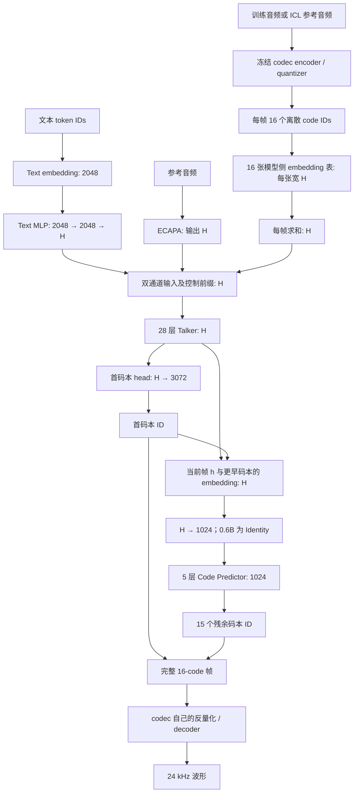

# 官方 Qwen3-TTS 12Hz：结构、维度与初始化证据

核对日期：2026-09-08。范围是 **12Hz Base 的 0.6B / 1.7B**，不把 25Hz、CustomVoice 和 VoiceDesign 的差异混在一起。本机实际运行代码为 `qwen-tts==0.1.1`；同时核对官方在线配置和实现。官方结构与本工程最终选择分别记录，本工程入口见 [当前结构](final-architecture.md)。

主要来源：[0.6B 配置](https://huggingface.co/Qwen/Qwen3-TTS-12Hz-0.6B-Base/blob/main/config.json)、[1.7B 配置](https://huggingface.co/Qwen/Qwen3-TTS-12Hz-1.7B-Base/blob/main/config.json)、[模型实现](https://github.com/QwenLM/Qwen3-TTS/blob/main/qwen_tts/core/models/modeling_qwen3_tts.py)、[codec 配置](https://huggingface.co/Qwen/Qwen3-TTS-Tokenizer-12Hz/blob/main/config.json)、[技术报告 §3](https://arxiv.org/html/2601.15621v1#S3)。本地 0.6B checkpoint revision 为 `5d83992436eae1d760afd27aff78a71d676296fc`，codec 为 `7dd38ad4e9bad454aae9cd937d0cd577604fe229`；在线 main 链接可能随后变化。

## 1. 先区分三个“维度”

1. **codec 内部向量宽度**：量化器和音频 encoder/decoder 内使用的浮点特征。
2. **codec ID 的类别数**：每个有效码本有 2048 个可选 ID；2048 在这里是词表大小。
3. **Talker 音频 token embedding 宽度**：ID 查表后进入 Talker 的向量，0.6B 是 1024，1.7B 是 2048。

这三者不要求相等。codec 与 Talker 通过离散整数 ID 连接，而不是把 codec 内部浮点向量直接送进 LLM。



`H=1024` 对应 0.6B，`H=2048` 对应 1.7B。图中模型侧 audio embedding 与 codec 内部 codebook 是不同参数，不共享同一张表。

## 2. Text embedding 与 text MLP

| 项目 | 官方 0.6B | 官方 1.7B |
|---|---|---|
| text embedding weight | `[151936,2048]` | `[151936,2048]` |
| MLP 第一个 Linear | `2048→2048`，有 bias | `2048→2048`，有 bias |
| 激活 | SiLU | SiLU |
| MLP 第二个 Linear | `2048→1024`，有 bias | `2048→2048`，有 bias |
| 输出进入 Talker | 1024 | 2048 |

对应路径为 `talker.model.text_embedding` 与 `talker.text_projection.linear_fc1/linear_fc2`。它是 token 查表加两层 MLP，不是另一个完整的上下文文本 encoder，也不是检索用的 Qwen3-Embedding 模型。

**为什么固定 2048？公开证据没有给出完整答案。** 两个模型的配置都如此，但报告没有说明这张 embedding 表最初取自哪个 text checkpoint，也没有明确说明统一输入宽度的动机。Qwen3-1.7B-Base 的 hidden size 也是 2048，只能说明形状兼容，不能证明权重来源、共享或蒸馏关系。

1.7B 两侧同宽仍使用 MLP，说明它包含非线性特征变换，不只是改变 shape。可以推测统一文本接口便于适配不同尺寸 Talker，但不能把推测写成官方训练事实。对已经训练好的官方 checkpoint，删除这个 MLP 会改变其学到的函数，即使两侧维度相同也不能直接删。

## 3. Talker decoder

| 项目 | 0.6B | 1.7B |
|---|---:|---:|
| 层数 | 28 | 28 |
| hidden size H | 1024 | 2048 |
| FFN intermediate size | 3072 | 6144 |
| Query heads / KV heads | 16 / 8 | 16 / 8 |
| 每 head 宽度 | 128 | 128 |
| Q projection | 1024→2048 | 2048→2048 |
| K / V projection | 1024→1024 | 2048→1024 |
| attention output projection | 2048→1024 | 2048→2048 |
| attention / FFN dropout | 配置 attention_dropout=0 | 配置 attention_dropout=0 |
| RMSNorm epsilon | 1e-6 | 1e-6 |
| RoPE theta | 1e6 | 1e6 |
| 配置最大位置数 | 32768 | 32768 |

每层采用前置 RMSNorm、带 Q/K norm 的 GQA attention、残差连接，再接前置 RMSNorm、SwiGLU FFN 和残差连接；末尾还有 final RMSNorm。不能用 `H / num_heads` 反推本模型 head_dim：0.6B 的显式 head_dim 仍是 128。

Talker 使用官方多轴位置编码实现，配置 `mrope_section=[24,20,20]`、interleaved。普通文本／音频时序可给三个轴相同位置，退化为一维位置；这不意味着需要视觉输入。

## 4. 音频 embedding 与首码本输出

| 参数 | 0.6B shape | 1.7B shape |
|---|---|---|
| `talker.model.codec_embedding.weight` | `[3072,1024]` | `[3072,2048]` |
| `talker.codec_head.weight` | `[3072,1024]` | `[3072,2048]` |
| 残余 embedding，每组各一张，共 15 张 | 每张 `[2048,1024]` | 每张 `[2048,2048]` |

第 0 张 embedding 表兼容控制 token，所以有 3072 行；有效音频内容 ID 是 0–2047。主要控制 ID：pad=2148、BOS=2149、EOS=2150、think=2154、nothink=2155、think_bos=2156、think_eos=2157。文本侧 `<tts_pad>`=151671、BOS=151672、EOD=151673，与音频侧 token 不同。

一帧不是把 16 组向量拼成 `16H`，而是求和成 H：

`audio_frame_t = E_0[c_t,0] + E_1[c_t,1] + … + E_15[c_t,15]`。

所以 **1.7B 的历史音频帧天然已经是 2048 维，不需要在音频 embedding 到 Talker 之间再加 projector**。首码本输出 head 预测下一个离散 ID，而不是直接回归 codec 内部特征。

## 5. Code Predictor：1.7B 确实有另一处 projection

两种尺寸的 Code Predictor 都是 **5 层、hidden 1024、FFN 3072、16 Q / 8 KV heads、head_dim 128**。15 个输出 head 各为 `1024→2048`，这里输出的 2048 是每个残余码本的类别数。

它的 embedding 表却采用 Talker 的宽度 H，因为这些表还要参与上一节的音频帧求和。于是需要以下连接：

| 路径 | 0.6B | 1.7B |
|---|---|---|
| Talker hidden / 模型侧 code embedding → Code Predictor | 1024→1024，Identity | 2048→1024，Linear，有 bias |
| 模块名 | `small_to_mtp_projection` | 同名 |

这个 projection 作用于送进深度预测器的整组输入，包括 `h_t` 和已经知道的码本 embedding；不是 codec encoder 输出到 Talker 的 adapter。

当前帧 t 的预测顺序：

1. Talker 从文本、音色和历史音频得到 `h_t`，用首 head 预测 `c_t,0`。
2. 深度模型先输入 `[h_t, E_0(c_t,0)]`，预测 `c_t,1`。
3. 继续输入刚生成的 code 的 embedding，顺序预测至 `c_t,15`。
4. 16 个 ID 交给 codec decoder；它们的模型侧 embedding 求和后，成为下一步 Talker 的历史帧输入。

训练时可以用 causal mask 并行 teacher forcing，但 `h_t` 必须是看到目标帧之前的 hidden。官方公开 SFT 示例有标签对齐相关 issue，不能据此跳过独立的训练／推理一致性检查。

## 6. Speaker encoder

官方 Base 使用 ECAPA-TDNN。输入是 24 kHz 音频的 128 维 log-mel：FFT/window 1024、hop 256、fmin 0、fmax 12000。默认通道为 `[512,512,512,512,1536]`，含 TDNN、SE-Res2Net、聚合和 attentive statistics pooling，最终 FC 输出 H。

因此 0.6B 输出 1024、1.7B 输出 2048，可以直接占据 Talker 的音色位置。报告明确说 speaker encoder 与 backbone 联合训练；公开 SFT 示例中的 `detach()` 是单说话人微调选择，不能当成预训练冻结证据。

公开 checkpoint 里的 speaker encoder 已经受过 Qwen 训练；是否最初加载外部说话人识别模型，报告没有说明。它与 SpeechBrain VoxCeleb 的 16 kHz、80 mel、192 维 ECAPA 并不兼容。

## 7. 独立的 12Hz codec

输入／输出均为 24 kHz；总下／上采样倍数 1920，对应 `24000/1920=12.5` 帧／秒。交给 TTS 的有效输出为每帧 16 个 ID：1 组语义码本，15 组声学残余码本。

配置中的 encoder 为 causal Conv 编码加 8 层 Transformer，hidden 512、FFN 2048、8 Q/KV heads、head_dim 64；量化向量宽 256、codebook size 2048。encoder 配置保留 32 个 quantizer 容量，但顶层 `encoder_valid_num_quantizers=16`，不能据内部容量误写成 TTS 使用 32 组。

decoder 包含自身的反量化、8 层 Transformer（hidden 512、FFN 1024、16 Q/KV heads、head_dim 64）以及因果卷积上采样；配置的内部 codebook 向量宽为 512，latent_dim=1024、decoder_dim=1536。内部 `[2,2]` 与 `[8,5,4,3]` 的总上采样乘积为 1920。这些维度不随 Talker 选择 0.6B 或 1.7B 而改变。

报告称 codec 训练用 WavLM 语义监督、RVQ 声学分支及音频重建／对抗目标。这与 TTS 文本 backbone 的初始化是两项独立工作。本工程复用其已训练 encoder/decoder，不重新训练 codec。

## 8. 官方输入与 reference 路径

在 `language=Auto`、Base x-vector、非流式模式下，有效序列如下。每个加号表示同位置相加，逗号表示时间轴拼接：

```text
E_text(ChatML assistant 角色),
E_text(pad) + E_codec(nothink / think_bos / think_eos),
E_text(pad) + speaker_vector,
E_text(text_bos) + E_codec(pad),
E_text(完整文本及 text_eod) + E_codec(pad),
E_text(pad) + E_codec(audio_bos),
E_text(pad) + sum(历史帧 16 组 embedding), ...
```

此处 `E_text` 包含官方 text MLP。指定语言时控制前缀换成 think、think_bos、language ID、think_eos；不应把 Auto 模式表格当成全部语言模式。

流式模式把逐步到达的文本向量和音频历史向量在对应位置相加，文本耗尽后补 text pad。非流式模式先提供全部文本，再在音频阶段补 text pad。两者都属于双通道编排。

音色可以通过 reference waveform 的 speaker embedding 注入；ICL 则还提供 reference transcript 和 reference codec。非流式 ICL 的文本侧是 reference text + target text + text EOD，音频侧是 audio BOS + reference codec，再继续生成。不能在 reference codec 末尾加入整段音频 EOS，否则会把续写条件变成已经结束的样本。

存在 ICL 推理分隔与前缀，只能证明推理接口支持这种条件化方式，不能证明官方预训练一定显式采样了独立的 reference/target 对，也不能证明其从未这样做。报告未公开到这个粒度。

## 9. 初始化：已知事实、未知细节、我们的决定

| 问题 | 可支持的结论 |
|---|---|
| 官方是否使用 Qwen3 模型体系？ | 是，报告明确说明；模型结构和配置可核对 |
| 每个模块究竟来自哪个初始 checkpoint？ | 公开报告和推理代码不足以完整还原 |
| 2048 维 text embedding 来自 1.7B Base 吗？ | 形状兼容，来源未确认 |
| 0.6B 和 1.7B 是否共享同一张文本表？ | 同形状不等于同权重，不能据配置断言 |
| 官方已训练的 MLP 可以重置／删除吗？ | 不能保持原函数；会改变已学习的输入映射 |
| 从同一个 0.6B Base 加载 embedding 与 decoder，必须加 MLP 吗？ | 不必须；同源同宽可以直接连接 |
| 新增音频表、输出 head、深度预测器能从文本 LM 原样加载吗？ | 没有逐项对应的文本参数，须训练新模块或明确选择其他预训练来源 |

本工程当前先采用官方 2048 维 text embedding 和已训练 MLP 的成套公开权重，并冻结两者；28 层 Talker decoder / norm 从 Qwen3-0.6B-Base 加载；ECAPA 和 codec 加载 Qwen 公开权重；音频 embedding、输出 head 和 Code Predictor 新初始化。这样优先对齐官方结构并保护文本前端，但前端与文本 Base 主干并非原本共同训练，仍需在 Emilia2 上验证适配效果。直接连接、解冻和重新初始化前端留作后续独立消融。

可验证的初始化要求是：共享文本 token 的 ID 不变；除新增 TTS token 行外 embedding 不变；decoder/norm 权重严格一致；每个新模块有明确记录；加载时不接受缺失权重后静默随机补齐。完整训练配置、产物 SHA256、来源 revision 和对照实验应与这些结构说明一起保存。
