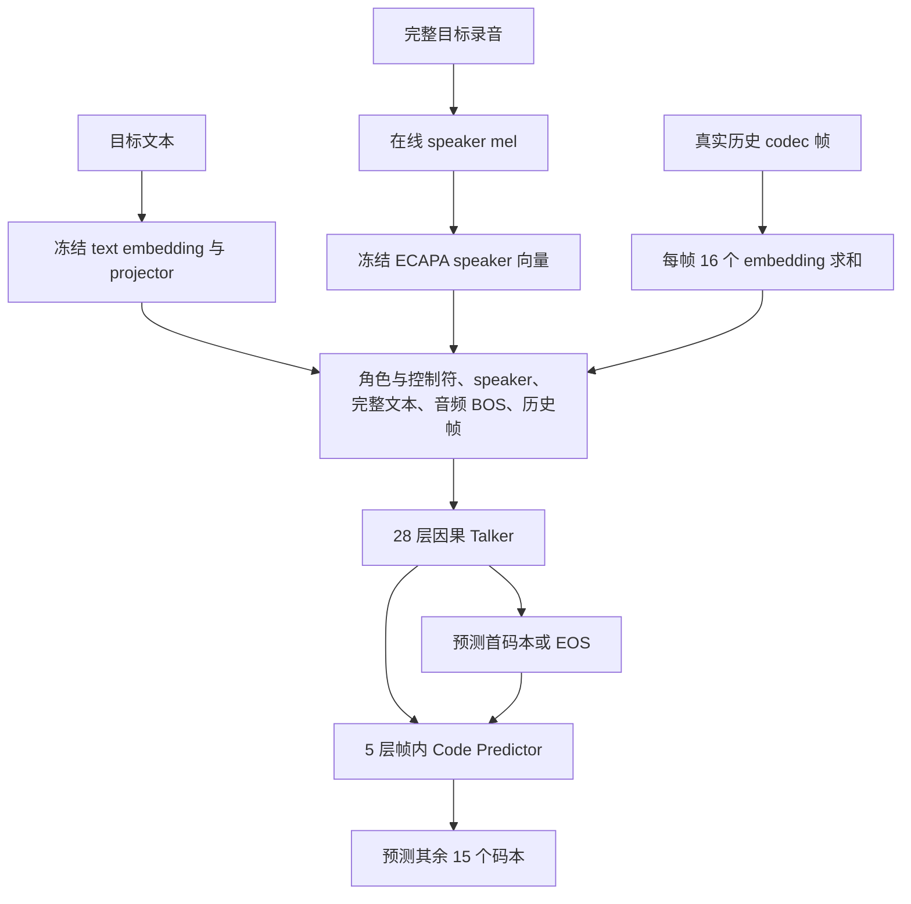

# Emilia2 中英 1kh 训练与评估报告

记录日期：2026-09-09。实验目录：[`runs/emilia-en-zh-pretrain-1000h`](../../runs/emilia-en-zh-pretrain-1000h/)。本文记录这次已经完成的实验；后续 DataLoader、ICL evaluation 和 10kh 训练的改动不追溯为本轮设置。

## 1. 实验结果与结论

本轮使用约 **500 小时英语 + 500 小时中文**，从文本 Base 主干和随机初始化的音频预测模块开始训练，共完成 **5,000 次优化更新，约 1.14 个数据 epoch**。最终 checkpoint 于 2026-09-09 11:41 UTC 完成，最后一轮验证音频汇总于 11:45 UTC 写出。

模型已明显学到音频 token 预测：512 条验证集的首码本/EOS CE 从第 100 步的 **7.2188** 降到第 5,000 步的 **1.8087**，残余码本平均 CE 从 **7.5487** 降到 **6.8805**。但自由生成的内容准确率没有随 CE 持续改善：固定 4 条英文的规范化 WER 在第 2,500 步为 **33.70%**，最终为 **54.35%**；固定 4 条中文的 CER 在第 3,500 步为 **49.24%**，最终为 **65.15%**。

因此，本轮证明了训练链路和音频预测学习能够运行，**尚不能认定生成质量已经稳定，也不能仅按最低验证 CE 选择最好的生成模型**。本轮生成评估只提供同说话人的另一条录音所提取的 speaker embedding，未提供参考文本或参考 codec 前缀，不属于 ICL 评估。生成样本数量很小，下面的结果用于诊断，不能代表完整测试集质量。

## 2. 数据由什么组成

### 2.1 来源与筛选

数据源为 `/ai_sds_wuzz/DATA_TTS/Emilia2_TTS_m4a/` 中的 Emilia2 tar 及 `.tar.idx`。通过索引定位元数据和 M4A 成员，不整体解包 tar。

本轮只使用元数据顶层 `type=short` 的独立完整录音，语言为 `en` 或 `zh`，标注时长 **2–10 秒**。不使用 long 的短句视图或 dialogue，不截断原文或目标音频。文本 token 上限为 256；这批数据没有样本因该上限被剔除。long 切片属于后续 10kh 数据准备，不能混入本轮的数据描述。

| 语言 | 总条数 | 训练条数 | 验证条数 | 总时长 | 训练时长 |
|---|---:|---:|---:|---:|---:|
| 英语 | 415,515 | 415,259 | 256 | 500.0002 h | 499.6825 h |
| 中文 | 426,316 | 426,060 | 256 | 500.0009 h | 499.6938 h |
| 合计 | 841,831 | 841,319 | 512 | 1,000.0011 h | 999.3763 h |

验证时长为 0.62475 小时。训练集有 151,422 个 speaker ID，验证集有 505 个 speaker ID。训练录音平均 4.276 秒，最长 10 秒；原始文本最长 86 个 token，codec 最长 125 帧。这里的 speaker ID 数量不是经人工确认的真实人数。

时长和条数以 [`preparation.json`](/ai_sds_wuzz/DATA_TTS/Emilia2_TTS_prepared/LM-TTS-Training/emilia-short-en-zh-1000h/preparation.json) 为准；speaker、长度统计另从最终 train/val manifest 逐行核对。

### 2.2 训练与验证如何划分

每种语言使用 seed 42 打乱候选，留出 256 条规范化文本唯一、且同 speaker 可以保留至少两条训练录音的样本。检查训练/验证 ID 和规范化文本不相交。训练保留只有一条录音的 speaker；这类 speaker 不作为需要另一条参考录音的生成评估候选。

这是**已见说话人的未见文本验证**，不是 speaker-disjoint 的零样本说话人测试。1kh 的选择规则允许同 speaker 有多条验证录音，因此 512 条验证录音对应 505 个 speaker。英语、中文合并后自然参与采样，没有强制每个 batch 的语言条数或时长恰好 1:1。

### 2.3 数据文件结构

```text
emilia-short-en-zh-1000h/
├── part-0/                 英语 prepared 数据及缓存引用
├── part-1/                 中文 prepared 数据及缓存引用
├── train.jsonl             最终训练入口
├── val.jsonl               最终验证入口
├── preparation.json        完成后的条数、时长、配方
└── PREPARATION_COMPLETE    数据发布完成标记
```

每行样本包括 `id`、原始 `text`、`speaker`、`language`、`duration`、`text_ids`、`codes`、`codes_sha256`、`num_frames` 和 `audio_source`。`audio_source` 保存原始 tar、成员名、偏移、大小、采样点数及采样率；`codes` 指向 NPZ。部分 codec 复用既有英文缓存，读取仍依赖被引用的缓存目录。`audio` 字段可能是按需生成的 WAV 位置，不能仅凭该字段存在就认为 WAV 已落盘。

原始音频解码成单声道并重采样到 24 kHz，由冻结的 Qwen3-TTS codec 编码。每个 NPZ 存储 `[T, 16]` 离散 token，每组取值 0–2047，帧率 12.5 Hz。codec 标签已离线准备；speaker mel 仍在线从原始音频计算。因此“已提取 codec”不等于训练完全不再读取音频。

## 3. 模型结构与初始化

组装入口为 [`pretrained/assembled-qwen3-tts-frozen-conditioning`](../../pretrained/assembled-qwen3-tts-frozen-conditioning/)，具体权重来源、版本和哈希保存在 [`assembly_report.json`](../../pretrained/assembled-qwen3-tts-frozen-conditioning/assembly_report.json)。

| 模块 | 结构 | 初始化来源 | 本轮是否更新 |
|---|---|---|---|
| 文本 embedding | 151,936 × 2,048 | Qwen3-TTS-12Hz-0.6B-Base，完整表 | 冻结 |
| 文本 projector | 2,048 → 2,048 → 1,024，SiLU | 同一 Qwen3-TTS checkpoint | 冻结 |
| Talker 主干 | 28 层，hidden 1,024，FFN 3,072 | Qwen3-0.6B-Base 的 layers/norm | 更新 |
| 首码本 embedding/head | 3,072 类，hidden 1,024 | 随机初始化 | 更新 |
| Code Predictor | 5 层，hidden 1,024；15 张 embedding 和 15 个 2,048 类 head | 整个模块随机初始化 | 更新 |
| speaker encoder | ECAPA-TDNN，128 mel → 1,024 维 | Qwen3-TTS checkpoint | 冻结 |
| codec encoder/decoder | 24 kHz，16 码本 | Qwen3-TTS-Tokenizer-12Hz | 独立冻结 |

训练模型共 **914,643,008** 个参数，其中可训练 **588,329,216**、冻结 **326,313,792**，不含独立 codec。这是利用文本主干预训练权重学习 TTS；未加载公开 TTS 的已训练 Talker 主干和 Code Predictor，也未使用文本 LM 输出 head。



采用 Qwen3 非流式协议，先提供完整文本。时间自回归沿音频帧推进；每个历史帧的 16 个码本 embedding 相加，占一个时间位置。帧内再按码本顺序预测剩余 15 组。训练使用 teacher forcing，生成时使用模型已经生成的历史。

训练 speaker 条件来自完整目标录音，但仅通过冻结 ECAPA 的全局向量输入。生成评估换用同 speaker 的另一条训练录音，只提取 speaker embedding。本轮没有把另一条录音的文本或 codec 当作生成上下文。

## 4. 如何训练

### 4.1 优化目标

```text
first_ce    = 所有真实首码本及每条录音一个 EOS 的 CE 总和 / Σ(T + 1)
residual_ce = 所有真实帧、15 个残余码本的 CE 总和 / (15 × ΣT)
loss        = first_ce + 0.3 × residual_ce
```

计数跨所有 GPU 和梯度累积的 microbatch 汇总，按有效 token 归一化。文本位置不计算 LM loss；没有波形重建 loss、ASR loss 或独立 speaker loss。两项音频 loss 都能反传到 Talker；两组学习率按参数来源划分，并非分别对应两项 loss。

### 4.2 实际运行配置

来源为落盘的 [`baseline-config.yaml`](../../runs/emilia-en-zh-pretrain-1000h/baseline-config.yaml) 和最终 [`metadata.json`](../../runs/emilia-en-zh-pretrain-1000h/checkpoints/step-00005000/metadata.json)。

| 配置 | 实际值 |
|---|---|
| GPU / 分布式 | 4 × A100 80GB，FSDP2 |
| 计算 | BF16，梯度归约 FP32，Flash Attention 2 |
| 每卡 batch / accumulation | 48 / 1 |
| 有效全局 batch | 192 条录音/更新 |
| 优化器 | AdamW，weight decay 0.01 |
| 主干峰值 LR | 2e-5 |
| 新音频模块峰值 LR | 1e-4 |
| 学习率计划 | 200 步 warmup；cosine 衰减；总 horizon 5,000 步；下限为峰值的 10% |
| gradient clipping | 全局范数上限 1.0 |
| activation checkpointing | 关闭 |
| 验证 loss | 每 100 步，全体 512 条 |
| checkpoint / 音频生成 | 每 500 步；8 条验证、2 条训练固定文本 |
| checkpoint 保留策略 | 运行期间只保留最近 2 个完整 checkpoint |

本轮前 1,000 步之后迁移为 padding-free，完成恢复检查后继续训练；迁移证据见 [`padding-free-resume.json`](../../runs/emilia-en-zh-pretrain-1000h/padding-free-resume.json)。最终进度为 `step=5000, epoch=1, next_batch=619`。

本轮采样使用当时的自写长度分桶：seed+epoch 打乱索引，随机丢弃不足全局 microbatch 的尾部，桶内按文本与音频长度排序后组 batch、分配各 rank。CPU 使用 4 个线程并发读取当前 microbatch。**后续新增的 PyTorch DistributedSampler/DataLoader 预取未用于这次已完成的 1kh 实验。**

每 epoch 有 4,381 次更新，5,000 步约看到 960,000 条录音（含第二遍），约 1.14 epoch。最终 LR 为主干 2e-6、新模块 1e-5。第 4,000–5,000 步的已记录训练点平均约 2.06 秒/更新、385.7 音频秒/墙钟秒、峰值 allocated 25.70 GiB；这些是常规训练点统计，不含 checkpoint/音频评估耗时，也不是最长 batch 的显存保证。

## 5. Evaluation 方法与结果

### 5.1 两类评估回答不同问题

**Teacher-forcing validation**：全体 512 条，使用真实历史 codec 和目标录音的 speaker 条件，衡量正确上下文下预测下一个离散 token 的能力。

**自由生成**：固定 8 条验证文本（英文 4、中文 4）及 2 条训练文本（每种语言 1 条），使用同 speaker 的另一条训练录音提取音色向量。首码本和帧内码本均 greedy/argmax；首码本只允许 0–2047 或 EOS。最多生成 160 帧，即 12.8 秒；到上限仍未输出 EOS 记为 truncated。

生成音频用多语种 Whisper `small`、CPU int8、beam size 5 转写；同一目标原音频也做 ASR 对照。英文报告 Whisper 英语规范化后的 WER；中文主要看 CER。当前通用 WER 按空白分词，不适合直接用来解释中文准确率；中英混合汇总 WER 也不作为主要结论。

### 5.2 512 条验证集的 loss

| Step | 首码本 + EOS CE | 15 个残余码本平均 CE |
|---:|---:|---:|
| 100 | 7.2188 | 7.5487 |
| 500 | 5.4649 | 7.3041 |
| 1,000 | 3.1834 | 7.2356 |
| 1,500 | 2.4363 | 7.1354 |
| 2,000 | 2.1822 | 7.0577 |
| 2,500 | 2.0396 | 7.0034 |
| 3,000 | 1.9568 | 6.9600 |
| 3,500 | 1.8954 | 6.9277 |
| 4,000 | 1.8491 | 6.9025 |
| 4,500 | 1.8258 | 6.8901 |
| 5,000 | 1.8087 | 6.8805 |

最终第一个残余码本 CE 为 4.5165，最后一个为 7.4490，各组学习进展差别很大。最终训练日志点为首 CE 1.7254、残余 CE 6.8524，但单个训练 batch 与完整验证集不宜直接视为严格可比的泛化差距。原始证据见 [`train-flash.log`](../../runs/emilia-en-zh-pretrain-1000h/train-flash.log) 和 [`train-padding-free.log`](../../runs/emilia-en-zh-pretrain-1000h/train-padding-free.log)。

### 5.3 固定验证文本的生成结果

每一行都是同一组 8 条文本。指标按错误数/参考总长度聚合，不是逐句百分比简单平均。

| Step | 英文规范化 WER（4 条） | 中文 CER（4 条） | 达到长度上限（8 条） |
|---:|---:|---:|---:|
| 500 | 96.74% | 100.00% | 6/8 |
| 1,000 | 92.39% | 90.91% | 1/8 |
| 1,500 | 67.39% | 78.03% | 0/8 |
| 2,000 | 42.39% | 76.52% | 2/8 |
| 2,500 | 33.70% | 75.00% | 1/8 |
| 3,000 | 35.87% | 50.76% | 1/8 |
| 3,500 | 69.57% | 49.24% | 2/8 |
| 4,000 | 47.83% | 78.79% | 2/8 |
| 4,500 | 45.65% | 59.85% | 1/8 |
| 5,000 | 54.35% | 65.15% | 1/8 |

同一批原始目标音频的英文规范化 WER 为 **8.70%**、中文 CER 为 **18.94%**，明显低于最终生成结果。ASR 与标注本身存在误差，中文转写还可能包含繁简差异；不能把生成 CER 的每一个字符错误都归因于模型，但当前生成错误也不能仅用识别器误差解释。

最终 8 条中 7 条输出 EOS，1 条英文达到 160 帧上限。EOS 成功并不等于内容正确：最终中文还存在时长约为目标 1.71 倍的样本，英文截断样本 CER 约 85.96%。应结合音频、转写、删词和重复情况检查。最后两条训练文本的英文规范化 WER 为 35.71%、中文 CER 为 68.18%；每种语言只有一条，不能据此判断整体训练集拟合程度。

可核查的产物：

- [第 2,500 步生成汇总](../../runs/emilia-en-zh-pretrain-1000h/evaluation/step-00002500/summary.json)
- [第 3,500 步生成汇总](../../runs/emilia-en-zh-pretrain-1000h/evaluation/step-00003500/summary.json)
- [最终验证生成汇总](../../runs/emilia-en-zh-pretrain-1000h/evaluation/step-00005000/summary.json)
- [最终训练文本生成汇总](../../runs/emilia-en-zh-pretrain-1000h/train-evaluation/evaluation/step-00005000/summary.json)
- [最终英文样本音频](../../runs/emilia-en-zh-pretrain-1000h/evaluation/step-00005000/sample-00/generated.wav) 与 [逐句记录](../../runs/emilia-en-zh-pretrain-1000h/evaluation/step-00005000/sample-00/metrics.json)
- [最终中文样本音频](../../runs/emilia-en-zh-pretrain-1000h/evaluation/step-00005000/sample-256/generated.wav) 与 [逐句记录](../../runs/emilia-en-zh-pretrain-1000h/evaluation/step-00005000/sample-256/metrics.json)

本轮未报告 MOS、人工听评或量化 speaker similarity；不能据这些 ASR 指标声称音质自然或克隆音色准确。后期 CE 与生成指标分离可能涉及训练覆盖量、训练与生成条件差异、自回归误差积累等，现有证据不足以把原因归结为某一个因素。

## 6. 保存范围与后续实验

**完整保留 `runs/emilia-en-zh-pretrain-1000h/`，不覆盖、不清理。** 完整保护范围和关联依赖见 [实验产物保留清单](run-retention.md)。当前仍存在第 4,500、5,000 步两个 checkpoint，以及全部已落盘的配置、日志、TensorBoard、验证与训练生成音频。更早的权重已由本轮原有保留策略清理，其生成音频与指标仍在；这次整理不再做清理。

```text
runs/emilia-en-zh-pretrain-1000h/
├── baseline-config.yaml / config.yaml
├── initialization.json / model_config.json
├── train.log / train-flash.log / train-padding-free.log
├── checkpoints/
│   ├── step-00004500/
│   ├── step-00005000/
│   └── latest
├── tensorboard/
├── evaluation/step-*/sample-*/
└── train-evaluation/evaluation/step-*/sample-*/
```

`pipeline-status.json` 仍可能显示历史启动阶段 `train`；判断是否完成应以第 5,000 步完整 checkpoint 和评估产物为依据。此前的暂停/恢复文档是历史记录，不代表本轮当前仍处于暂停状态。

10kh已使用独立run从原始组装模型重新训练，采用主干1e-4、新音频模块3e-4、warmup1000步，以及动态组批的PyTorch DataLoader。它不接续本轮的音频权重或优化器状态。完整数据包含512条验证目标，其中511条有合格ICL参考，在线固定评估中英各4条；范围和进度见[10kh正式训练记录](emilia-10kh-supervision.md)。
