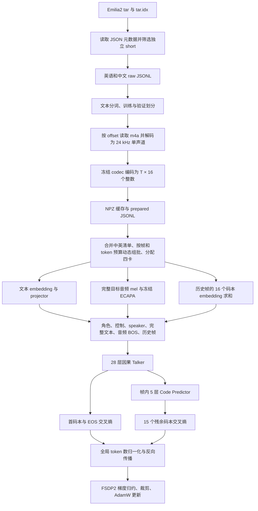

# Emilia2 中英预训练：从原始录音到四卡 loss

本文对应当前实现和 [`configs/emilia-pretrain.yaml`](../../configs/emilia-pretrain.yaml)。目标数据是 **约 500 小时英语 + 500 小时中文**，模型采用 Qwen3-TTS 的非流式输入结构，使用 Qwen3-0.6B-Base 初始化 Talker 主干，训练音频预测能力。

实现已统一采用 padding-free 布局和按帧/token 预算动态组批。此前固定 batch 的 1kh 训练已完成 5,000 步，结果见 [1kh 报告](emilia-1kh-report.md)，产物按 [保留清单](run-retention.md) 归档。当前配置输出到新的动态组批 run；试训与验证见 [动态组批说明](dynamic-batching.md)。

先明确三个容易混淆的地方：

- **训练输入**是目标文本、目标录音提取的 speaker 向量，以及 teacher forcing 的历史 codec 帧。speaker encoder 冻结，但当前每次训练在线计算其输出。
- **生成评估输入**是目标文本和同说话人的另一条训练录音。开始时没有目标 codec 帧，之后逐帧生成。
- **优化目标**只有离散音频 token 的交叉熵：首码本和 EOS 一项，剩余 15 个码本一项。没有文本 LM loss、波形重建 loss、ASR loss 或 speaker 对比 loss。

旧英语基线用另一条录音提供训练 speaker 条件，并删除 singleton speaker；当前预训练已经改为完整目标录音提供该条件，因此保留 singleton 训练样本。旧缓存中的 codec 标签仍可在音频和 codec 配方一致时复用；训练语义发生变化，正式训练使用新的 run 目录。

## 1. 全流程与入口



当前控制入口：

```bash
PYTHONPATH=. .venv/bin/python scripts/run_emilia_baseline.py --nproc-per-node 4
```

尽管脚本名称保留 `baseline`，默认配置已指向中英预训练。它依次准备两个 raw manifest、合并 prepared 清单、做最长样本显存测试、写出实际 batch 配置、启动训练。若中文 exporter 尚在运行，可传 `--export-pid <实际 Python PID>`；控制进程会先处理已存在的英语清单，再等待中文清单原子发布。

| 位置 | 内容 |
|---|---|
| `/ai_sds_wuzz/DATA_TTS/Emilia2_TTS_m4a/` | 只读原始 tar 与索引 |
| `/ai_sds_wuzz/DATA_TTS/Emilia2_TTS_prepared/LM-TTS-Training/` | raw manifest、codec 缓存、prepared manifest、按需音频 |
| 上述目录下 `emilia-short-en-zh-1000h/part-0/` | 英语 prepared 数据 |
| 上述目录下 `emilia-short-en-zh-1000h/part-1/` | 中文 prepared 数据 |
| 上述目录下 `emilia-short-en-zh-1000h/train.jsonl`、`val.jsonl` | 合并后的训练入口 |
| `runs/emilia-en-zh-dynamic-1000h/` | 当前配置的新运行输出：流程状态、日志、配置、checkpoint、TensorBoard、生成评估 |

阶段状态写入 `pipeline-status.json`，控制脚本持有 `pipeline.lock` 防止重复启动。数据完成以 `PREPARATION_COMPLETE` 和 `preparation.json` 为准；约 1,000 小时是筛选目标，实际条数和时长应读取报告。

2026-09-09 全量 raw 清单与文本/划分检查的实测结果如下。这些是编码前检查结果，不表示全部 codec 缓存或正式训练已经完成：

| 语言 | 通过文本筛选的条数 | 原始时长 | 计划验证条数 |
|---|---:|---:|---:|
| 英语 | 415,515 | 500.0002 小时 | 256 |
| 中文 | 426,316 | 500.0009 小时 | 256 |
| 合计 | 841,831 | 1,000.0011 小时 | 512 |

本轮没有样本因文本 token 长度被剔除；全量 ID 和跨语言 train/val 规范化文本交集检查均通过。2026-09-09 全量 codec 编码和清单合并已完成，实际训练 **841,319 条、999.3763 小时**，验证 **512 条**；合并目录的 `PREPARATION_COMPLETE` 和 `preparation.json` 已写出。

## 2. 原始数据如何读取和筛选

实现：[`export_manifest.py`](../../scripts/export_manifest.py)、[`sources.py`](../../qwen3_train/sources.py)。

### 2.1 tar 不整体解包

每个 `.tar.idx` 记录 member 名称、字节 offset、字节 size。导出器先读取索引，再直接 `seek(offset)` 读取 JSON member。它根据 JSON 找到对应 `.m4a` member，将其位置记入清单；**导出元数据阶段不进行 codec 编码，也不把整库音频解压到目录**。

索引文件按路径排序，8 个 shard 并行读取，每批结果按原始顺序返回。数据选择是确定性的 shard 顺序截取，不是全库随机抽样。英语当前从已经导出的英语 1,000 小时 raw 清单按原顺序取前约 500 小时，中文单独导出约 500 小时。

### 2.2 接收什么录音

本轮要求语言为 `en` 或 `zh`，原始标注时长 2–10 秒，只接收 JSON **顶层 `type=short`** 的独立完整录音。`short` 列表必须只有一个元素，而且其起止采样点必须覆盖整个载体。不会从 long/dialogue 的嵌套 short 描述中截取片段，也不依据文件名猜类型。

speaker 和文本必须存在，样本 ID 不得重复。`dnsmos` 会记录在元数据中；当前没有基于该分数的筛选阈值。

### 2.3 raw JSONL 的一行

以下是字段结构示意，数值和文本仅作解释：

```json
{
  "schema_version": 1,
  "id": "emilia2:sample_id",
  "text": "今天我们开始训练。",
  "speaker": "emilia2:speaker_id",
  "language": "zh",
  "duration": 4.8,
  "audio": {
    "kind": "tar_member",
    "archive": "/path/to/shard.tar",
    "member": "sample_id.m4a",
    "offset": 123456,
    "size": 65432,
    "frames": 211680,
    "sample_rate": 44100
  },
  "source": {
    "dataset": "emilia2",
    "type": "short",
    "recording_id": "recording_id",
    "dnsmos": null
  }
}
```

此时 `audio` 是读取位置描述，不是落盘 WAV 路径。`duration` 来自标注采样点数除以采样率。导出先写 `.incomplete`，成功后 rename 为 `.jsonl`，下游不会读取正在增长的半份清单。

## 3. 预处理：文本、划分、波形与 codec

实现：[`prepare_manifest.py`](../../scripts/prepare_manifest.py)。

### 3.1 文本分词

使用组装模型目录的 Qwen tokenizer：

```python
tokenizer = AutoTokenizer.from_pretrained(tokenizer_path, fix_mistral_regex=False)
text_ids = tokenizer.encode(text, add_special_tokens=False)
```

保留 `1 <= len(text_ids) <= 256` 的样本；超限样本删除，不截断文本。此处不加入 TTS 文本 BOS/EOD，训练进程加载清单后才加。关闭 Mistral regex 修补是为了保留本地 Qwen tokenizer 原生分词规则。

用于 train/val 去重的文本规范化与分词是两回事。去重采用 NFKC、转小写、统一撇号、按 Unicode 字词提取并统一空白；它不重写送入 tokenizer 的训练文本。

### 3.2 训练和验证划分

每份语言清单先按 seed 42 确定性打乱，再选择验证样本。本轮每种语言留出 256 条，共计划 512 条。

验证候选需要满足：该规范化文本在当前语言清单中唯一，而且移出这条后，该 speaker 仍至少有两条训练录音。这样生成评估能从训练池找到同说话人的另一条录音。训练池本身保留 singleton speaker，它们可参加目标音频条件下的预训练，只是不作为需要另一条参考录音的生成样本。

两个语言的 prepared 清单合并时，还会检查全局 ID 重复和规范化文本的 train/val 交集；若发现交集，流程失败，不带泄漏启动训练。当前验证主要测同说话人的未见文本，不是未见说话人的 zero-shot 验证。

### 3.3 m4a 解码和长度处理

`decode_emilia_audio()` 根据 locator 从 tar 读取确切字节，交给 PyAV/FFmpeg 的 MP4 解复用器处理，包括 edit list。随后：

1. 在标注采样率下解码成 float32 单声道。
2. 核对解码采样点数与标注 `frames`。
3. 允许最多 1,023 个额外采样点，裁去 AAC 尾部 padding；若尾部缺口不超过约 1 毫秒，则补零并记录警告；偏差更大直接报错。
4. 用 `scipy.signal.resample_poly` 重采样为 24 kHz，保留 float32 波形。

这不会拉伸音频来迎合标注。codec 路径和训练时的目标 speaker 音频路径复用同一个 Emilia 解码函数。

### 3.4 离线 codec 编码

使用冻结的 `Qwen3-TTS-Tokenizer-12Hz`，实际 codec 帧率为约 **12.5 帧/秒**。每帧 16 个码本，每个码本 2,048 类。一个样本的结果为：

```text
24 kHz 波形 [samples]
    → 冻结 codec encoder
    → 整数 codes [T, 16]，取值 0…2047
```

`T` 以 codec 实际输出为准，不通过 `duration × 12.5` 强行生成标签长度。缓存使用 `uint16` NPZ；训练读取时转为 `int64`。每份 NPZ 检查二维形状、16 个码本、非空和取值范围，并保存 SHA256。

四卡预处理使用 `torchrun` 启动四个独立进程，每个进程持有本卡的 codec 实例。rank `r` 处理从 `r × 16` 开始、间隔 `world_size × 16` 的 batch；每卡 codec batch 为 16。每个 rank 使用 16 个 spawn CPU 解码进程、16 个 I/O 线程，GPU 编码与 CPU 解码配合。初始运行使用每 rank 4 个解码进程，定位随机读取等待后，先测 8 个，再提高到一个完整 batch 的并发度 16；解码进程数和 I/O 线程数属于执行参数，不改变缓存 recipe。各 rank 最后写临时行清单，由 rank 0 按确定性样本顺序合并发布。

英语旧 codec 缓存可通过 `--reuse-codes-from` 复用。复用前要求 codec 配置/权重哈希、音频尾部处理策略、codec batch size 一致；对应 NPZ 以硬链接接入新目录，读取时继续验证其内容。不复用旧训练/验证划分，不复用旧 speaker 条件分配。

### 3.5 prepared 清单是什么

prepared 行保留原始文本、speaker、language、source，并增加：

| 字段 | 含义 |
|---|---|
| `text_ids` | 原生 tokenizer 输出，尚无 TTS BOS/EOD |
| `codes` | NPZ 路径；语言子目录中为相对路径，合并入口中为绝对路径 |
| `num_frames` | NPZ 的实际时间维 `T` |
| `codes_sha256` | 当前 NPZ 文件内容哈希 |
| `audio_source` | 原始 tar locator |
| `audio` | 按需生成 WAV 的目标路径，不保证该文件已经存在 |
| `duration` | 24 kHz 重采样后的预计波形长度对应时长 |

默认不保存所有训练 WAV；训练 speaker 条件会重新从 tar 解码。生成评估的目标原音频需要播放或 ASR 时，通过 `evaluation_audio()` 按需落盘。

当前预处理 recipe 为 v4，包含 `speaker_conditioning=full_target_audio`，避免和旧的删除 singleton、指定参考录音的 recipe 混用。codec 编码完成不等于模型已训练。

## 4. 一个 batch 如何进入模型

实现：[`CodeDataset / collate / DistributedTokenBatchSampler`](../../qwen3_train/data.py)、[`audio_mel`](../../qwen3_train/speaker.py)、[`train.main`](../../qwen3_train/train.py)。

### 4.1 清单与样本读取

每个训练 rank 各自将完整 train/val JSONL 读入内存，记录 manifest SHA256。加载组装模型时，为每个样本的 `text_ids` 加上：

```text
[tts_text_bos=151672, 原始文本 token..., tts_text_eod=151673]
```

每次取样本时读取 NPZ，核对 SHA256，检查 codec 形状和范围。设置 `target_speaker=True` 后，还会解码该样本的**完整目标录音**，转换为 speaker mel。

训练使用 PyTorch `DataLoader`，每个 rank 默认 4 个 worker 进程，每个 worker 提前准备 2 个 microbatch，由 `train.num_workers` 和 `train.prefetch_factor` 调整。worker 使用 `spawn` 启动并跨 epoch 复用，在 CPU 上完成 NPZ 读取、音频解码、mel 和 `collate()`；主进程通过 pinned memory 将 batch 传到 GPU。worker 根据字节索引读取 manifest，不复制主进程的完整样本字典列表。

没有提前缓存 speaker embedding，因此 codec 已缓存仍会发生原始音频读取、解码、mel 和 ECAPA 计算。预取使 CPU 准备数据与 GPU 训练重叠，`train/data_wait_seconds` 记录每步获取 microbatch 的等待时间。验证 loss 目前仍按样本顺序读取。

### 4.2 speaker mel 和向量

完整目标波形在 24 kHz 下按官方 mel 函数处理：`n_fft=1024`、`win_size=1024`、`hop_size=256`、128 mel、`fmin=0`、`fmax=12000`。输出转为 `[M_i, 128]`。

当前不把目标音频裁成固定 3 秒，也不为短录音重复波形。`collate()` 将 mel 连续存储，同时保存 `speaker_lengths`。模型先按长度拆出每条完整录音，再按相同长度分组交给 ECAPA。ECAPA 的全局统计池化和 squeeze-excitation 不会看到补齐帧或其他录音。

ECAPA 输出 `[B, 1024]`，每条录音一个音色向量。它保持 `eval()` 且所有参数 `requires_grad=False`。冻结只表示不更新权重，当前仍在线执行前向；不存在单独 speaker loss。

### 4.3 分布式采样和四卡分配

训练通过 PyTorch `DataLoader(batch_sampler=DistributedTokenBatchSampler(...))` 动态组批。每卡每个 microbatch 同时受 `train.max_batch_frames`（目标 codec 帧总数）和 `train.max_batch_tokens`（完整 Talker 输入 token 总数，包含文本、控制符、speaker 和 audio BOS）限制。超预算的单条样本会报错，不静默跳过。每个 epoch 使用 `seed + epoch` 打乱样本，按当前预算占用率给各 rank 分配可容纳的下一条样本；当所有 rank 都容纳不下时结束这组 batch。因此各 rank 的 batch 数一致、无重复填充，样本数可不同；仅在 epoch 尾部不足以给所有 rank 各分一条时丢弃至多 `world_size - 1` 条随机尾部样本。

checkpoint 保存已消费的 `epoch / next_batch`，不计入 worker 提前读取的 batch。恢复时由 Accelerate 的 `skip_first_batches()` 跳过已消费索引，避免重新解码这些样本。动态 batch 边界由相同数据、seed、epoch 和预算重建。每步样本数可变，loss 分母仍是所有 rank、全部累积 microbatch 的实际目标数。TensorBoard 记录 `global_samples`、`global_audio_frames`、`global_talker_tokens` 和两种 `*_budget_fill`；验证组批大小单独由 `eval.batch_size` 控制（默认 8）。

中英数据按合并清单自然参与采样。500:500 小时不是每个 batch 强制 1:1 的样本数；两种语言平均录音长度不同时，样本数也可能不同。

### 4.4 batch 张量

设本卡样本数为 `B`，各样本含 BOS/EOD 的文本长度为 `N_i`、codec 帧数为 `T_i`、mel 长度为 `M_i`：

| 张量 | shape | 说明 |
|---|---|---|
| `text_ids` | `[Σ N_i]` | 连续存储有效文本 token |
| `text_lengths` | `[B]` | 每条文本的长度 |
| `codes` | `[Σ T_i, 16]` | 连续存储真实 codec 帧 |
| `frame_lengths` | `[B]` | 每条音频的 codec 帧数 |
| `speaker_mels` | `[Σ M_i, 128]` | 连续存储有效 mel 帧 |
| `speaker_lengths` | `[B]` | 每条 mel 的长度 |

没有文本、音频或 mel 补齐槽位。0 仍是合法 codec ID；样本边界由长度记录，而不是 token 值决定。张量在模型调用前迁移到本 rank 的 GPU。

## 5. 模型从哪里初始化，哪些参数参与训练

实现：[`TTSModel.from_assembled`](../../qwen3_train/model.py)、[`assembly.py`](../../qwen3_train/assembly.py)。组装产物的 `config.json` 和 `assembly_report.json` 是具体权重与维度的依据。

| 模块 | 结构/维度 | 来源 | 是否更新 |
|---|---|---|---|
| 文本 embedding | `[151936, 2048]` | 公开 Qwen3-TTS-0.6B，完整表 | 冻结 |
| 文本 projector | `2048 → 2048 → 1024`，SiLU | 同一 TTS checkpoint | 冻结 |
| Talker layers/norm | 28 层，hidden 1024，FFN 3072，16 Q heads / 8 KV heads，head_dim 128 | Qwen3-0.6B-Base | 更新 |
| 首码本 embedding / head | `[3072,1024]` / `1024→3072` | 新初始化 | 更新 |
| 残余 embedding | 15 张 `[2048,1024]` | 新初始化 | 更新 |
| Code Predictor | 5 层，hidden 1024，15 个 2048 类 head | 新初始化 | 更新 |
| Talker 到 Predictor 的投影 | 同宽 Identity | 无参数 | 不适用 |
| ECAPA | 128 mel → 1024 维 | 公开 Qwen TTS | 冻结 |
| codec encoder/decoder | 24 kHz，16 码本 | 公开 Qwen codec | 独立冻结 |

训练模型共 **914,643,008** 参数，冻结 **326,313,792**，可训练 **588,329,216**，不含独立 codec。这里没有加载公开 TTS 的已训练 Talker 主干和音频预测模块，也没有使用文本 LM 的输出 head。

加载器要求 `ASSEMBLY_COMPLETE`，校验组装配置和权重文件哈希，再严格加载权重。冻结策略由本项目 `TTSModel` 执行；公开 wrapper 是否能加载相同形状，并不代表它会自动执行这些冻结设置。

## 6. 模型真正看到的输入序列

实现：[`TTSModel.input_embeddings / hidden`](../../qwen3_train/model.py)。以下描述的是本轮 `qwen3_non_streaming`、Auto language 路径。

定义：

- `E_t(x)`：文本 embedding 后再经过 projector，最终 1024 维。
- `E_0(c)`：首码本 embedding；`E_g(c)`：第 `g` 个残余码本 embedding。
- `p = E_t(tts_pad)`：投影后的文本 pad 向量。
- `s`：该录音的 1024 维 speaker 向量。
- `c[t,g]`：第 `t` 帧、第 `g` 组 codec 标签，`g=0…15`。

一帧历史音频不是 16 个时间位置，而是 **16 个 embedding 相加成一个时间位置**：

```text
audio_frame(t) = E_0(c[t,0]) + E_1(c[t,1]) + ... + E_15(c[t,15])
```

输入沿时间轴依次拼接：

| 段 | 位置数 | 每个位置的 1024 维输入 |
|---|---:|---|
| assistant 角色 | 3 | `E_t([151644, 77091, 198])` |
| 非流式控制 | 3 | `p + E_0(nothink / think_bos / think_eos)` |
| speaker | 1 | `p + s` |
| 文本 BOS、完整文本、文本 EOD | `L + 2` | `E_t(text_id) + E_0(codec_pad)` |
| 音频 BOS | 1 | `p + E_0(codec_bos)` |
| 历史音频帧 | `T` | `p + audio_frame(t)` |

`L` 是原始文本 token 数，所以单条无 padding 的训练有效长度为 `L + T + 10`。加号表示同位置向量相加；不同表格行表示时间轴拼接。

关键 codec token：`codec_pad=2148`、`codec_bos=2149`、`codec_eos=2150`、`nothink=2155`、`think_bos=2156`、`think_eos=2157`。中文和英文都走 Auto 路径，当前没有额外插入 `codec_language_id[chinese/english]`；清单的 language 字段用于筛选、分组评估与 ASR 语言选择。

**完整文本在音频前面**，因此每个音频位置都能看见本样本的全部文本。各样本的有效 embedding 拼成 `[1, Σ sequence_length_i, 1024]`，每条样本的 position ID 从 0 重新开始。FA2 通过显式 int32 累积长度和最大样本长度计算独立的因果 attention 段，既不能看到未来音频，也不能看到其他样本。CPU／SDPA 检查使用相同 packed 输入和分段因果 mask。

## 7. 首码本和 EOS 的 loss

实现：[`TTSModel.forward`](../../qwen3_train/model.py)。

### 7.1 时间对齐

Talker 输出按索引去掉文本/角色/speaker 前缀，只保留各样本从音频 BOS 开始的 hidden，shape 为 `[Σ (T_i + 1), 1024]`。设一条样本有 `T` 帧：

| hidden 所在输入位置 | 可见的音频历史 | 首 head 的目标 |
|---|---|---|
| 音频 BOS，记作 `h_0` | 无音频帧 | `c[0,0]` |
| 帧 0 之后，`h_1` | 帧 0 | `c[1,0]` |
| 帧 `t-1` 之后，`h_t` | 帧 `0…t-1` | `c[t,0]` |
| 最后一帧之后，`h_T` | 全部 `T` 帧 | EOS |

例如只有两帧时，输入的音频段为 `[BOS, frame_0, frame_1]`，首 head 标签为 `[c[0,0], c[1,0], EOS]`。`h_t` 预测帧 `t` 时尚未看到帧 `t` 的 codec 输入。speaker 向量本来就是目标录音的全局条件；这里的因果约束指 codec 时间序列不会提前提供目标帧。

### 7.2 标签与计算

首 head 输出 `[Σ (T_i + 1), 3072]` logits，转 float32 后调用交叉熵。每条样本的标签依次为全部真实首码本 ID 和一个 EOS；每段末尾位置由 `(frame_lengths + 1).cumsum(0) - 1` 确定。

```text
S_first = Σ_i [Σ_(t=0…T_i-1) CE(head(h_i,t), c_i[t,0])
               + CE(head(h_i,T_i), EOS)]
N_first = Σ_i (T_i + 1)
```

文本位置不进入该 head，每条录音恰好贡献一个 EOS。训练 softmax 覆盖 head 的全部 3072 类，普通音频标签为 0…2047，终止标签为 2150。

## 8. 同一帧内 15 个残余码本的 loss

Talker 用时间自回归预测首码本，Code Predictor 在同一帧内用码本顺序自回归补全其余 15 组。

先从音频 hidden 中排除每条样本预测 EOS 的末尾位置，得到真实帧对应的 `h_t`，与连续存储的 `codes` 一一对应。所有样本的真实帧组成 `F = Σ_i T_i` 条帧内训练序列，不包含 EOS 位置。

每条帧内输入长度为 16：

```text
[h_t, E_0(c[t,0]), E_1(c[t,1]), ..., E_14(c[t,14])]
```

这形成 `[F, 16, 1024]` 输入，经过 5 层因果 Code Predictor。第 `g` 个残余 head 使用帧内位置 `g` 的输出，预测 `c[t,g]`，其中 `g=1…15`：

| 要预测的标签 | 可见帧内输入 |
|---|---|
| `c[t,1]` | `h_t` 和真实 `c[t,0]` |
| `c[t,2]` | `h_t`、真实 `c[t,0]`、真实 `c[t,1]` |
| … | … |
| `c[t,15]` | `h_t` 和真实 `c[t,0…14]` |

这是 teacher forcing：训练中已知前面的真实码本，一次因果前向即可并行计算所有残余位置。目标 `c[t,g]` 不进入预测它的当前位置；`c[t,15]` 不需要作为帧内输入，但它会参与下一时间帧的 Talker 历史 embedding。

每组 head 输出 2048 类 logits，各自转 float32 后计算 CE：

```text
S_residual = Σ_i Σ_(t=0…T_i-1) Σ_(g=1…15) CE(head_g(depth_i,t,g), c_i[t,g])
N_residual = 15 × Σ_i T_i
```

没有“残余码本 EOS”标签。模型还返回 15 个独立的 `group_sums`，用于报告每个残余码本的验证 CE。

## 9. 最终 loss、四卡归一化和参数更新

### 9.1 全局目标

本轮 `residual_weight=0.3`：

```text
L = S_first_global / N_first_global
    + 0.3 × S_residual_global / N_residual_global
```

两项分别按各自有效 token 数平均。残余项已经除以 15，因此 0.3 是“平均残余 CE”的权重，不是把 15 项未经平均的 CE 之和再乘 0.3。

例如一个完整更新只有两条录音，帧数分别为 2 和 1：首项有 `2+1+2=5` 个目标，其中 3 个首码本和 2 个 EOS；残余项有 `3×15=45` 个目标。最终为 `S_first/5 + 0.3×S_residual/45`。这按 token 加权，不是先求每条录音平均再对录音平均；较长录音贡献更多帧标签。

### 9.2 FSDP 和 accumulation 下为什么乘 world size

每次优化更新先收集本 rank 的全部 accumulation microbatch，统计两类有效目标数，再用 `dist.all_reduce()` 将分母在所有卡上求和。每个本地 microbatch 用以下值反向：

```python
loss = world_size * (
    local_first_sum / global_first_count
    + residual_weight * local_residual_sum / global_residual_count
)
loss.backward()
```

FSDP 对各 rank 梯度做平均，前面的 `world_size` 抵消这个平均，最终得到上述全局 token 平均目标的梯度。不能把每个 rank 的局部平均 loss 再简单平均，因为各卡的有效帧数不同。

accumulation 的分母已包含当前更新全部 microbatch，所以不再额外除以 accumulation 次数。前面的 microbatch 关闭梯度同步，最后一个开启同步。当前正式配置 `accumulation=1`。

### 9.3 参数、精度和学习率

每个 Talker decoder block 和 Code Predictor block 分别 FSDP2 分片，最后包住整个模型。计算使用 BF16 mixed precision，梯度归约 FP32；CE logits 显式转 float32，优化器更新使用 FP32 参数分片。当前关闭 activation checkpointing。正式配置通过 `model.attn_implementation: flash_attention_2` 为 Talker 和 Code Predictor 启用 Flash Attention 2；未指定时使用 SDPA。训练与压测均设置 `FLASH_ATTENTION_DETERMINISTIC=1`，启用确定性反向计算。

当前环境使用官方预编译 `flash-attn 2.8.3.post1` wheel，匹配 Linux x86_64、Python 3.10、PyTorch 2.8、CUDA 12、CXX11 ABI=true，没有本地编译。依赖文件固定了 wheel URL 和 SHA256。FA2 的 NVIDIA CUDA 实现支持 BF16/FP16 attention，不接受 FP32 Q/K/V；模型初始构造时的 dtype 提示发生在 FSDP mixed precision 包装之前。安装来源和 SHA256 记录在 `runs/model-audit-20260909/flash-wheel-installed.json`。其他环境需安装与其 Python、Torch、CUDA 和 ABI 匹配的 wheel。

优化器只接收 `requires_grad=True` 的参数，使用 AdamW：

| 设置 | 当前值 |
|---|---:|
| Talker 预训练 layers/norm 基础学习率 | `2e-5` |
| 新音频模块基础学习率 | `1e-4` |
| weight decay | `0.01` |
| 全模型 gradient clipping norm | `1.0` |
| warmup | 200 updates |
| 总训练与调度长度 | 5,000 updates |

warmup 线性增长，之后 cosine 衰减至基础学习率的 10%。loss 和裁剪前梯度 norm 必须有限，否则直接停止。更新顺序是 `backward → clip_grad_norm_ → optimizer.step → scheduler.step`；日志中的学习率是在 scheduler 前进一步后记录的，对应下一次更新将使用的值。

### 9.4 动态预算如何确定

正式训练前，在实际合并清单中分别找最长文本和最长 codec 音频，把二者组合成压力样本。这项压测覆盖最长单条输入，实际混合长度和更多短句的批次仍需试训确认显存。从配置的帧和 token 预算开始，计算压力样本能容纳的条数；OOM 时依次尝试原预算的 80%、60%、40%。每档跑两次真实 FSDP 优化更新，覆盖 AdamW 状态分配；只有 CUDA OOM 才降档，其他错误直接停止。

通过的配置写入 run 下 `baseline-config.yaml`。2026-09-09 四张 A100 80GB、BF16、FA2、关闭 activation checkpointing，使用 88 个文本 token 和 125 个 codec 帧的组合压力样本：每卡 64 在第一次反向计算时 OOM；每卡 48 完成两次优化更新，峰值 allocated 60.39 GiB，reserved 67.76 GiB。该历史 1kh 运行每卡固定 batch 为 48，全局一次更新 `48 × 4 × 1 = 192` 条录音。压测日志为 `runs/emilia-en-zh-pretrain-1000h/memory-flash-batch{64,48}.log`。

## 10. 验证 loss 与生成评估

验证 loss 使用与训练相同的文本、目标 codec 和完整目标音频 speaker 条件，但 `no_grad()`。各卡统计 CE 总和和有效 token 数，归约后计算首 CE、平均残余 CE、15 个码本各自的 CE。最后不足一个全局 batch 时，没有真实样本的 rank 用标记为零权重的占位样本维持 FSDP 调用次数，统计时不计它。

当前每 100 updates 验证 loss；每 500 updates 从固定样本生成 8 条验证音频和 2 条训练音频，选择过程尽量平衡英语与中文。

生成与训练的区别：

1. speaker 条件换成同说话人的另一条**训练录音**，不用目标录音作为生成参考。
2. 目标 codec 清空，从音频 BOS 开始。
3. 首 head 仅允许 0…2047 和 EOS，使用 argmax；不是随机采样。
4. 若不是 EOS，帧内依次生成 15 个残余码本，使用已生成的前置码本。
5. 将完整 16 码本帧加入历史，继续下一帧，直到 EOS 或 `max_frames=160`。
6. rank 0 用冻结 codec decoder 还原 24 kHz 波形并写入文件/TensorBoard。

所有 rank 参与相同的生成前向以满足 FSDP 通信；保存音频和 ASR 在 rank 0 进行。当前生成未使用 KV cache，长音频生成会重复计算历史，评估期间的训练暂停时间应单独看待。

ASR 使用支持中英的 `faster-whisper small`，按每条样本的 `language` 显式转写，CPU int8 执行。原目标音频也跑 ASR 作为对照。英语另外报告 Whisper 英语规范化后的 WER/CER；中文主要看 CER，当前按空白划词的通用 WER 不等价于中文分词后的 WER。混合指标之外按语言分别汇总。

ASR、生成时长比例、EOS、截断率都只是评估指标，不进入训练反向传播。验证 CE 使用目标音频条件，而生成使用另一条录音条件，二者也不能视为完全相同输入条件下的同一个指标。

## 11. 保存、恢复和可复现边界

实现：[`checkpoint.py`](../../qwen3_train/checkpoint.py)。

每 500 updates 保存一次，也在最后一步保存；保留最近两个完整 checkpoint。每份包含 DCP 模型和优化器状态、scheduler、`step / epoch / next_batch`、每个 rank 的 Python/NumPy/PyTorch/CUDA RNG 状态，以及恢复签名。

先写 `.incomplete`，全部 rank 保存完成后写 `COMPLETE`、rename，再更新 `latest`。只有新 checkpoint 完成后才清理旧的完整 checkpoint。恢复要求相同 world size、模型与冻结设置、manifest 哈希、动态组批算法与预算、accumulation、优化器和调度关键设置。当前签名还记录 `speaker_conditioning=full_target_audio` 与 `generation_conditioning=other_training_utterance`。

```bash
NPROC_PER_NODE=4 bash scripts/run_train.sh \
  --config runs/emilia-en-zh-dynamic-1000h/baseline-config.yaml \
  --resume latest
```

模型加载会核对组装配置/权重，训练会核对 NPZ 哈希；原始 tar 本身没有做全库内容哈希。由于 speaker 条件在线读取原音频，精确恢复仍要求源 tar 保持不变。只保留 manifest 和 NPZ、却更换原始 tar，并不满足这个条件。

当前 JSONL 会在每个 rank 全量常驻内存，NPZ 是每条录音一个文件。它适用于当前工程基线，尚不是数十万小时语料的分片流式实现。

## 12. 训练前已验证什么

2026-09-09 当前输入改动后的检查包括：

- 31 项单元测试，包括 loss/生成对齐、EOS/padding、冻结前端和 checkpoint 保留规则；padding 测试包含不同 speaker mel 长度。新增 CUDA 测试对照 BF16 下 SDPA/FA2 的变长 padding loss 与梯度，并验证 FA2 两次前向/反向逐值一致。
- 实际组装模型的输入 embedding 与安装的官方非流式实现对照，最大绝对误差约 `1.2e-7`。
- 实际模型的 padding loss、文本/speaker 条件响应和目标 codec 帧因果性检查。
- 四卡、变长样本、变长 speaker mel、两次 accumulation 与单模型全局 batch 的梯度对照，最大绝对误差约 `6.0e-8`。
- 1,024 条真实中英数据的四进程预处理，得到 1,008 train / 16 val；实际四卡训练、验证、生成和 checkpoint 保存，再从 step 2 恢复继续更新。
- 保存后的 81 个冻结张量、共 326,313,792 个参数与初始化逐值一致。
- 训练取样改为每卡 4 线程后，64 条中英样本的全部 batch 张量与串行读取逐值相同；同 seed 的两次实际四卡优化更新，其首/残余 CE 和 gradient norm 也与串行版本完全一致。

运行证据位于 `runs/model-audit-20260909/` 和 `runs/emilia-pretrain-integration/`。上述结果证明已覆盖的工程行为可运行，不能替代正式中英训练后的语音质量、收敛与泛化评估。正式数据完成、选定 batch 和训练进度以当前 run 的日志为准。

可重复运行的基础检查：

```bash
.venv/bin/python -m unittest discover -s tests -p 'test_*.py' -v
PYTHONPATH=. .venv/bin/torchrun --standalone --nproc_per_node=4 \
  tests/check_distributed_equivalence.py \
  --speaker --qwen-protocol --frozen-frontend --frozen-speaker
```
